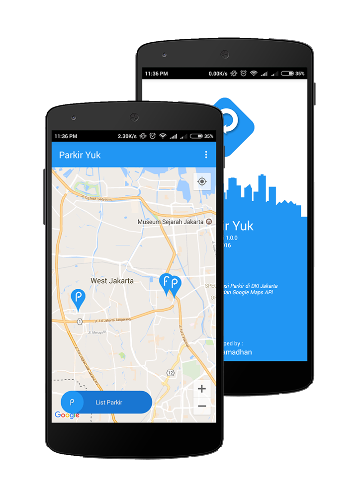
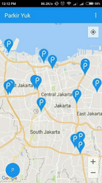
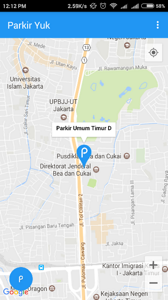
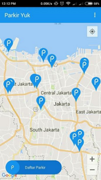

# Parkir Yuk!

## Introduction

Didasari dari situs [Smart City DKI Jakarta](http://smartcity.jakarta.go.id/maps/). Parkir liar merupakan peringkat pertama yang dilaporkan melalui Qlue, dan kurangnya informasi mengenai lahan parkir resmi.

>_“Simple way to find the parking area and reduce the problem of illegal parking”_

Parkir Yuk merupakan salah satu aplikasi yang dapat mempermudah para pengendara bermotor untuk mendapatkan informasi lahan parkir umum disekitar DKI Jakarta, dan bertujuan untuk mengurangi parkir liar.

## Screenshots

## Website
[Parkir Yuk! Website](http://parkiryuk.pe.hu)
